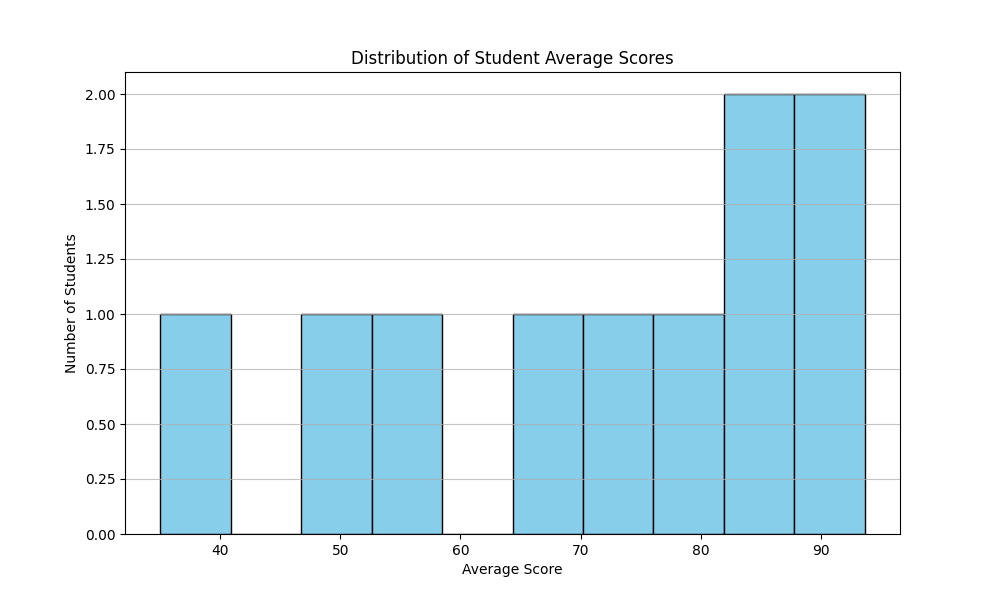

# Student Performance Analyzer

A Python tool to analyze student grades, identify at-risk students, and visualize score distributions. This project demonstrates modern DevOps practices including CI/CD, automated testing, and linting.

## 🚀 Features

- **Data Analysis**: Calculates average scores across multiple subjects.
- **Risk Identification**: Automatically flags students with an average score below a configurable threshold.
- **Visualization**: Generates a histogram of student average scores.
- **Automated Reporting**: GitHub Actions workflow generates and uploads reports automatically.

## 📂 Project Structure

```
student_performance_analyzer/
├── .github/workflows/   # CI/CD definitions
├── data/                # Input data and generated reports
├── docs/                # Documentation
├── src/                 # Source code
│   ├── analyzer.py      # Data analysis logic
│   ├── visualizer.py    # Plotting logic
│   └── main.py          # Entry point
├── tests/               # Unit tests
├── .gitignore           # Git ignore rules
├── requirements.txt     # Python dependencies
└── README.md            # Project documentation
```

## 🛠️ Installation

1. **Clone the repository:**
   ```bash
   git clone https://github.com/username/student_performance_analyzer.git
   cd student_performance_analyzer
   ```

2. **Set up a virtual environment (optional but recommended):**
   ```bash
   python -m venv venv
   source venv/bin/activate  # On Windows: venv\Scripts\activate
   ```

3. **Install dependencies:**
   ```bash
   pip install -r requirements.txt
   ```

## 📖 Usage

1. **Prepare your data:**
   Ensure you have a CSV file at `data/students.csv` with the following columns: `student_id`, `name`, `math_score`, `science_score`, `history_score`, `attendance_rate`.

2. **Run the analyzer:**
   ```bash
   python src/main.py
   ```

3. **View results:**
   - Console output will show average scores and at-risk students.
   - A plot will be saved to `data/score_distribution.png`.

## 🧪 Testing

Run the test suite using `pytest`:

```bash
pytest
```

## 🤖 CI/CD Workflows

This project uses GitHub Actions for automation:

1. **CI (`ci.yml`)**: Runs on every push and pull request to `main`.
   - Installs dependencies.
   - Lints code with `flake8`.
   - Runs unit tests with `pytest`.

2. **Generate Report (`generate_report.yml`)**:
   - **Trigger**: Runs every Monday at 8:00 AM UTC or manually via workflow dispatch.
   - **Action**: Executes the analysis script.
   - **Artifact**: Uploads the generated `score_distribution.png` as a build artifact for download.

## 📊 Example Output

**Console:**
```text
Loading data from .../data/students.csv...

Calculating average scores...
math_score       66.8
science_score    69.4
history_score    72.2
dtype: float64

Identifying at-risk students (threshold < 60)...
   student_id   name  average_score  attendance_rate
3           4  David      50.000000              0.6
5           6  Frank      35.000000              0.5
9          10   Jack      57.666667              0.75

Generating visualization to .../data/score_distribution.png...
Done.
```

**Visualization:**


